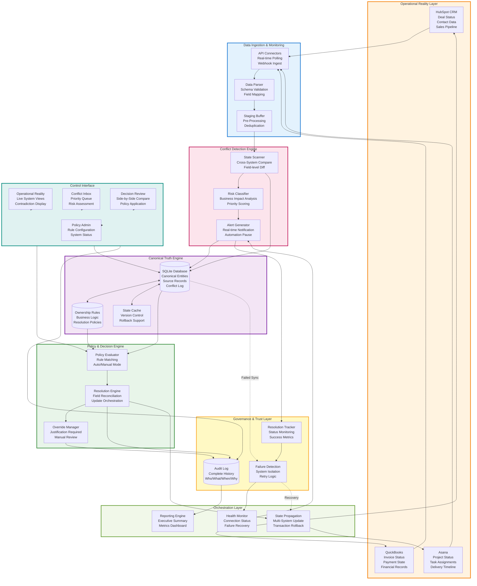

# Architecture Diagram for Video

**How to use:**
1. Copy the Mermaid code below
2. Go to https://mermaid.live
3. Paste and click "Download PNG"
4. Save as `demo-assets/architecture.png`
5. Show in video at 0:17 for 2 seconds

---

## Operational Control System Architecture

**Save as:** `demo-assets/architecture.png`

**When to show in video:** Timestamp 0:17 (flash for 2 seconds while explaining the system)

**Duration:** 2 seconds, then return to demo

---

## Key Architecture Highlights to Mention:

1. **Multi-Source Ingestion** - Continuously monitors HubSpot, QuickBooks, and Asana
2. **Real-time Conflict Detection** - Automatically identifies data inconsistencies 
3. **Canonical Truth Engine** - Single authoritative database with version control
4. **Policy-Driven Resolution** - Business rules determine conflict resolution (auto/manual)
5. **Complete Audit Trail** - Every decision tracked with justification
6. **Failure Isolation** - System failures don't corrupt data or cause silent errors
7. **Decision Control Interface** - Prevents wrong business decisions before they happen

**Positioning Statement:**
> "This isn't a dashboard or sync tool - it's a **decision control system** that prevents your business from making expensive mistakes based on inconsistent data."
