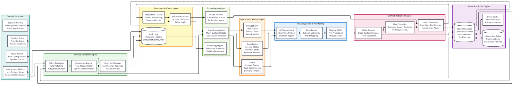

# Operational Control System

**A conflict-resolution and data-governance layer that holds one source of truth across disconnected business tools.**

Run a company on HubSpot, QuickBooks, and Asana and the same entity ends up in three places with three different states: a deal is Closed-Won in the CRM, its invoice is Unpaid in accounting, and its project still shows Started in the PM tool. Automations that blindly sync those tools just spread the wrong state faster. This system sits above them, detects the contradictions, and resolves them under explicit ownership rules instead of letting any one tool silently overwrite reality.



## How it works

- **Canonical truth engine.** One governed record per entity, with each source system's version tracked against it and a full version history.
- **Conflict detection.** A scanner compares source records field by field and logs every contradiction with a type, a risk level, and an age.
- **Policy-based ownership.** Each field has an owning system and a resolution mode. Invoice status is owned by QuickBooks and resolves automatically; deal status is owned by the CRM but held for manual review, because revenue recognition should not be automated away.
- **Decision control.** Conflicts land in an inbox. Each one shows every source's value side by side, the ownership rule that applies, and the rationale before anything is committed, and automation pauses while a conflict is open.
- **Governance and recovery.** A complete audit log of what changed, why, and by whom. On a source failure, that system is isolated and retried, and no partial data is written.

## Under the hood

`control_system.py` orchestrates the loop. `core/conflict_detector.py` finds the contradictions, `core/policy_engine.py` applies the ownership rules, and `core/external_systems.py` models the HubSpot, QuickBooks, and Asana connectors.

## Stack

Python · SQLite

## Run it

```bash
pip install -r requirements.txt
python initialize_demo.py     # seed the mock systems and a few live conflicts
python control_system.py
```
